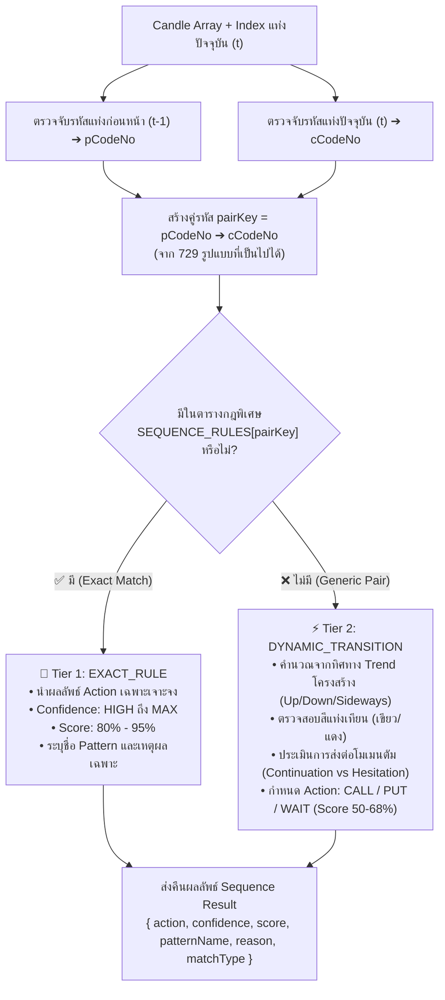
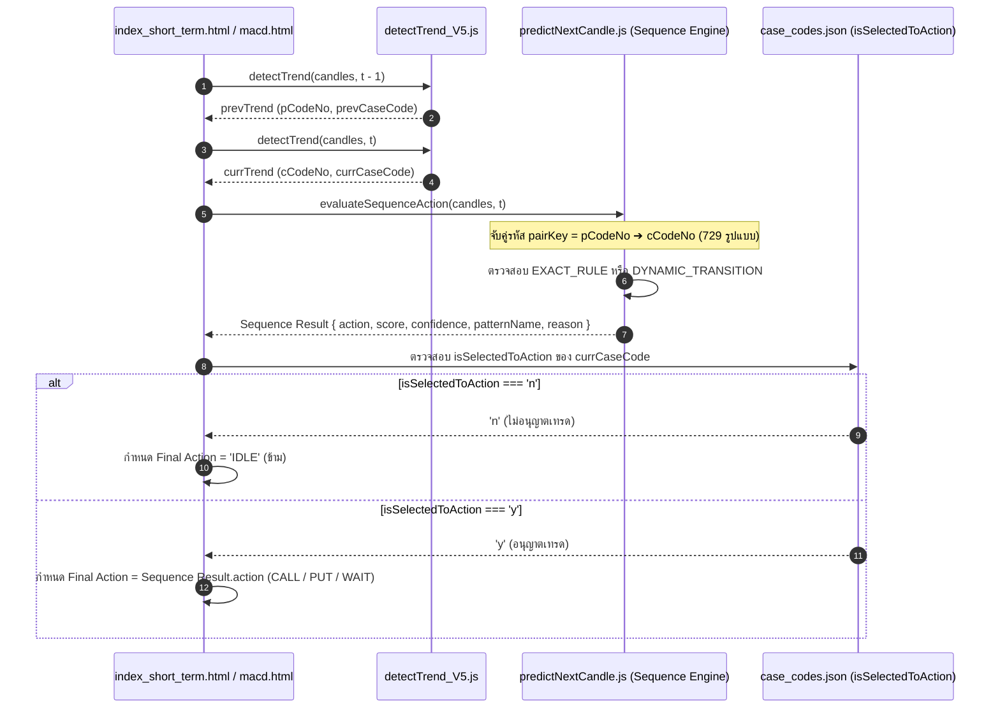

# 🔮 คู่มือสถาปัตยกรรมระบบ Forecast: 2-Bar Sequence Action Engine
> **การวิเคราะห์คู่รหัสแท่งเทียนต่อเนื่อง 2 แท่ง (Transition Matrix 27 × 27 = 729 รูปแบบ)**  
> ใช้สำหรับระบบวิเคราะห์แนวโน้ม ทำนายแท่งถัดไป และตัดสินใจออกออเดอร์ (CALL / PUT / WAIT) ใน [predictNextCandle.js](file:///d:/Rust/dynamicChart/predictNextCandle.js) และ [index_short_term.html](file:///d:/Rust/dynamicChart/index_short_term.html)

---

## 📌 สารบัญ (Table of Contents)
1. [ภาพรวมและแนวคิด (Overview & Core Concepts)](#1-ภาพรวมและแนวคิด-overview--core-concepts)
2. [คณิตศาสตร์คู่รหัส 27 × 27 = 729 รูปแบบ](#2-คณิตศาสตร์คู่รหัส-27--27--729-รูปแบบ)
3. [โครงสร้างสถาปัตยกรรม 2 ระดับ (2-Tier Architecture)](#3-โครงสร้างสถาปัตยกรรม-2-ระดับ-2-tier-architecture)
4. [ตารางรหัสมาตรฐาน 27 Case Codes](#4-ตารางรหัสมาตรฐาน-27-case-codes)
5. [ตารางกฎคู่รหัสแม่แบบ (Key Exact Rules)](#5-ตารางกฎคู่รหัสแม่แบบ-key-exact-rules)
6. [ระบบ Dynamic Transition (รองรับทุกคู่ใน 729 แบบ)](#6-ระบบ-dynamic-transition-รองรับทุกคู่ใน-729-แบบ)
7. [ระบบคัดกรอง Gatekeeper (isSelectedToAction)](#7-ระบบคัดกรอง-gatekeeper-isselectedtoaction)
8. [แผนภาพการทำงาน (Process Flowchart)](#8-แผนภาพการทำงาน-process-flowchart)

---

## 1. ภาพรวมและแนวคิด (Overview & Core Concepts)

การวิเคราะห์แท่งเทียนแบบแท่งเดียวโดดๆ (Single-Bar Analysis) มักจะเจอปัญหา **"สัญญาณหลอก (False Signals)"** หรือติดกับดักราคา (Traps) เนื่องจากไม่ทราบว่า **"แรงของแท่งก่อนหน้าถูกส่งต่อมาอย่างไร"**

**2-Bar Sequence Action Engine** ถูกออกแบบขึ้นมาเพื่อแก้ปัญหานี้ โดยนำ:
- **แท่งก่อนหน้า ($t-1$)**: ดูสภาวะที่เกิดขึ้นก่อนหน้า เช่น เกิด Inside Bar สะสมพลัง, เกิด Bull Trap, หรือเป็นแท่ง Breakout
- **แท่งปัจจุบัน ($t$)**: ดูพฤติกรรมแท่งปัจจุบันว่า ยืนยัน (Confirm), ปฏิเสธ (Reject), หรือทะลุกรอบ (Breakout)

เมื่อนำข้อมูลทั้งสองแท่งมาร้อยเรียงกันเป็น **"คู่รหัส (Transition Pair)"** จะทำให้อ่านจิตวิทยาตลาดได้อย่างแม่นยำสูงสุด

---

## 2. คณิตศาสตร์คู่รหัส 27 × 27 = 729 รูปแบบ

ในระบบตรวจจับแนวโน้ม [detectTrend_V5.js](file:///d:/Rust/dynamicChart/detectTrend_V5.js) มีการจำแนกรูปแบบแท่งเทียนออกเป็น **27 รูปแบบ (Case Code No. 1 ถึง No. 27)**

เมื่อนำรหัสของแท่งก่อนหน้า ($pCode$) และแท่งปัจจุบัน ($cCode$) มาจับคู่กันในเชิงสถิติและความน่าจะเป็น:

$$\text{Total Combinations} = 27 \times 27 = \mathbf{729\text{ รูปแบบ}}$$

### โครงสร้าง Matrix การจับคู่ ($27 \times 27$):
| แท่งก่อนหน้า ($t-1$) \ แท่งปัจจุบัน ($t$) | No. 1 (`UP-CONFIRM`) | No. 2 (`DN-CONFIRM`) | No. 3 (`SPK-CONTINUE-UP`) | ... | No. 27 (`SPK-WHIPSAW`) |
| :---: | :---: | :---: | :---: | :---: | :---: |
| **No. 1 (`UP-CONFIRM`)** | `1 ➔ 1` | `1 ➔ 2` | `1 ➔ 3` | ... | `1 ➔ 27` |
| **No. 2 (`DN-CONFIRM`)** | `2 ➔ 1` | `2 ➔ 2` | `2 ➔ 3` | ... | `2 ➔ 27` |
| **No. 17 (`SD-INSIDEBAR`)** | `17 ➔ 1` | `17 ➔ 2` | `17 ➔ 3` | ... | `17 ➔ 27` |
| **...** | ... | ... | ... | ... | ... |
| **No. 27 (`SPK-WHIPSAW`)** | `27 ➔ 1` | `27 ➔ 2` | `27 ➔ 3` | ... | `27 ➔ 27` |

---

## 3. โครงสร้างสถาปัตยกรรม 2 ระดับ (2-Tier Architecture)

ระบบใน [predictNextCandle.js](file:///d:/Rust/dynamicChart/predictNextCandle.js) ไม่ได้ปล่อยให้คู่รหัสใดหลุดการคำนวณ โดยแบ่งการทำงานเป็น 2 ชั้น:



---

## 4. ตารางรหัสมาตรฐาน 27 Case Codes

| No. | Case Code | กลุ่ม (Group) | ความหมาย | ทิศทางพื้นฐาน |
| :---: | :--- | :--- | :--- | :---: |
| **1** | `UP-CONFIRM` | UpTrend | แท่งเขียวทำ Higher High ยืนยันแนวโน้มขาขึ้น | 🟢 Up |
| **2** | `DN-CONFIRM` | DownTrend | แท่งแดงทำ Lower Low ยืนยันแนวโน้มขาลง | 🔴 Down |
| **3** | `SPK-CONTINUE-UP` | Spike | แท่งพุ่งขึ้นรุนแรงต่อเนื่องตามเทรนด์ | 🟢 Up |
| **4** | `SPK-CONTINUE-DN` | Spike | แท่งทิ่มลงรุนแรงต่อเนื่องตามเทรนด์ | 🔴 Down |
| **5** | `SPK-BULLTRAP` | Spike / Trap | แท่งพุ่งขึ้น New High แต่โดนทุบรูดมิด (กับดักกระทิง) | 🔴 Reversal Dn |
| **6** | `SPK-BEARTRAP` | Spike / Trap | แท่งทิ่มลง New Low แต่โดนซื้อกระชากกลับ (กับดักหมี) | 🟢 Reversal Up |
| **7** | `SPK-NODIRECTION` | Spike | แท่งผันผวนแต่ไม่มีทิศทางชัดเจน | ⚪ Neutral |
| **8** | `SPK-HESITANT-UP` | Spike | พุ่งขึ้นแต่เริ่มมีแรงต้านชะลอตัว | ⚪ Neutral |
| **9** | `EG-BULLISH` | Engulfing | แท่งเขียวกลืนกินแท่งก่อนหน้าเต็มตัว | 🟢 Strong Up |
| **10** | `EG-BEARISH` | Engulfing | แท่งแดงกลืนกินแท่งก่อนหน้าเต็มตัว | 🔴 Strong Down |
| **11** | `RJ-BULLTRAP-STRONG` | Rejection | ถูกแรงขายปฏิเสธอย่างรุนแรงที่แนวต้าน | 🔴 Reversal Dn |
| **12** | `RJ-BEARTRAP-STRONG` | Rejection | ถูกแรงซื้อปฏิเสธอย่างรุนแรงที่แนวรับ | 🟢 Reversal Up |
| **13** | `RJ-FOLLOWFAIL-UP` | Rejection | ขาขึ้นส่งต่อโมเมนตัมไม่สำเร็จ | ⚪ Neutral |
| **14** | `RJ-FOLLOWFAIL-DN` | Rejection | ขาลงส่งต่อโมเมนตัมไม่สำเร็จ | ⚪ Neutral |
| **15** | `RJ-UPWICK-WEAK` | Rejection | ไส้บนยาว กดดันฝั่งซื้อ | ⚪ Neutral |
| **16** | `RJ-LOWWICK-WEAK` | Rejection | ไส้ล่างยาว มีแรงพยุงฝั่งขาย | ⚪ Neutral |
| **17** | `SD-INSIDEBAR` | Sideways | แท่งบีบตัวอยู่ในกรอบแท่งก่อนหน้า (สะสมพลัง) | ⚪ Compression |
| **18** | `SD-MIXEDSIGNAL` | Sideways | สัญญาณขัดแย้ง High/Low ผันผวน | ⚪ Choppy |
| **19** | `SD-MIXEDSIGNAL-DN` | Sideways | สัญญาณขัดแย้ง โน้มเอียงทางลง | ⚪ Choppy |
| **20** | `SYS-NODATA` | System | ข้อมูลไม่เพียงพอในการวิเคราะห์ | ⚪ No Data |
| **21** | `SD-DOJI` | Sideways | แท่ง Doji ลังเล แรงซื้อแรงขายเท่ากัน | ⚪ Indecision |
| **22** | `SD-FLATRESISTANCE` | Sideways | ชนแนวต้านเดิมซ้ำๆ แล้วไม่ผ่าน | 🔴 Resistance |
| **23** | `SD-FLATSUPPORT` | Sideways | ชนแนวรับเดิมซ้ำๆ แล้วเด้งกลับ | 🟢 Support |
| **24** | `SD-NOSTRUCTURE` | Sideways | ไม่มีโครงสร้างเทรนด์ที่ชัดเจน | ⚪ Choppy |
| **25** | `EG-INDECISION` | Engulfing | กลืนกินแต่มีไส้สองข้าง ลังเล | ⚪ Indecision |
| **26** | `SPK-HESITANT-DN` | Spike | ทิ่มลงแต่เริ่มมีแรงรับชะลอตัว | ⚪ Neutral |
| **27** | `SPK-WHIPSAW` | Spike / Whipsaw | สับขาหลอกและผันผวนรุนแรง ไร้ทิศทาง | ⚪ Whipsaw |

---

## 5. ตารางกฎคู่รหัสแม่แบบ (Key Exact Rules)

| กลุ่มรูปแบบ | คู่รหัส ($p \rightarrow c$) | ชื่อแพทเทิร์น | Action | ความมั่นใจ | Score | เหตุผลทางเทคนิค |
| :--- | :---: | :--- | :---: | :---: | :---: | :--- |
| **Inside Bar Breakout** | `17 ➔ 1` | Inside Bar Breakout UP | 🟢 **CALL** | HIGH | 85% | Inside Bar สะสมพลังแล้วระเบิดทำ Higher High ขาขึ้นชัดเจน |
| | `17 ➔ 2` | Inside Bar Breakout DOWN | 🔴 **PUT** | HIGH | 85% | Inside Bar สะสมพลังแล้วระเบิดทำ Lower Low ขาลงชัดเจน |
| | `17 ➔ 9` | Inside Bar Bullish Engulfing | 🟢 **CALL** | **MAX** | 92% | สะสมพลังในกรอบแล้วตามด้วยแท่งเขียวกลืนกินเต็มแท่ง (Strong Bull Break) |
| | `17 ➔ 10` | Inside Bar Bearish Engulfing | 🔴 **PUT** | **MAX** | 92% | สะสมพลังในกรอบแล้วตามด้วยแท่งแดงกลืนกินเต็มแท่ง (Strong Bear Break) |
| | `17 ➔ 3` | Inside Bar Spike Breakout UP | 🟢 **CALL** | HIGH | 88% | Spike พุ่งทะลุกรอบ Inside Bar รุนแรง |
| | `17 ➔ 4` | Inside Bar Spike Breakdown DOWN | 🔴 **PUT** | HIGH | 88% | Spike ทิ่มทะลุกรอบ Inside Bar รุนแรง |
| | `17 ➔ 17` | Double Inside Bar Compression | ⚪ **WAIT** | HIGH | 90% | Inside Bar ซ้อน 2 แท่ง บีบตัวแคบสุดขีด รอเลือกทาง |
| **Traps & Reversals** | `1 ➔ 5` | UpTrend Spike Bull Trap | 🔴 **PUT** | **MAX** | 88% | ขาขึ้นทำ New High แล้วโดนทุบรูดมิดแท่ง (Bull Trap) เสี่ยงกลับตัวลงรุนแรง |
| | `1 ➔ 11` | UpTrend Strong Bull Trap | 🔴 **PUT** | **MAX** | 86% | พยายามทำ High แต่ถูกแรงขายปฏิเสธอย่างรุนแรง (Strong Bull Trap) |
| | `2 ➔ 6` | DownTrend Spike Bear Trap | 🟢 **CALL** | **MAX** | 88% | ขาลงทำ New Low แล้วมีแรงซื้อกระชากกลับปิดเต็มแท่ง (Bear Trap) กลับตัวขึ้นแรง |
| | `2 ➔ 12` | DownTrend Strong Bear Trap | 🟢 **CALL** | **MAX** | 86% | พยายามทำ Low แต่ถูกแรงซื้อดันกลับอย่างแข็งแกร่ง (Strong Bear Trap) |
| | `3 ➔ 5` | Double Spike Exhaustion Top | 🔴 **PUT** | **MAX** | 90% | Spike พุ่งสุดตัวแล้วตามด้วย Bull Trap จบคลื่นขาขึ้นทันที |
| | `4 ➔ 6` | Double Spike Exhaustion Bottom | 🟢 **CALL** | **MAX** | 90% | Spike ทิ่มสุดตัวแล้วตามด้วย Bear Trap จบคลื่นขาลงทันที |
| **Trap Confirmations** | `6 ➔ 1` | Bear Trap Confirmed UP | 🟢 **CALL** | **MAX** | 94% | Bear Trap ดักขายสำเร็จ และแท่งปัจจุบันดันทำ Higher High ยืนยันขาขึ้น |
| | `12 ➔ 1` | Strong Bear Trap Confirmed UP | 🟢 **CALL** | **MAX** | 92% | ยืนยันการกลับตัวขึ้นหลังเกิด Strong Bear Trap |
| | `5 ➔ 2` | Bull Trap Confirmed DOWN | 🔴 **PUT** | **MAX** | 94% | Bull Trap ดักซื้อสำเร็จ และแท่งปัจจุบันทุบทำ Lower Low ยืนยันขาลง |
| | `11 ➔ 2` | Strong Bull Trap Confirmed DOWN | 🔴 **PUT** | **MAX** | 92% | ยืนยันการกลับตัวลงหลังเกิด Strong Bull Trap |
| **Trend Continuation** | `1 ➔ 1` | UpTrend Solid Continuation | 🟢 **CALL** | HIGH | 82% | ทำ Higher High ต่อเนื่อง เทรนด์ขาขึ้นแข็งแกร่ง |
| | `2 ➔ 2` | DownTrend Solid Continuation | 🔴 **PUT** | HIGH | 82% | ทำ Lower Low ต่อเนื่อง เทรนด์ขาลงแข็งแกร่ง |
| | `1 ➔ 16` | UpTrend Pullback & Dip Buy | 🟢 **CALL** | HIGH | 80% | ขาขึ้นย่อติดแนวรับเกิดไส้ล่างยาวดันกลับ (Buy on Dip) |
| | `2 ➔ 15` | DownTrend Pullback & Sell Rally | 🔴 **PUT** | HIGH | 80% | ขาลงดีดติดแนวต้านเกิดไส้บนยาวกดลง (Sell on Rally) |
| | `1 ➔ 23` | UpTrend Retest Support | 🟢 **CALL** | HIGH | 76% | ขาขึ้นย่อทดสอบแนวรับเดิมแล้วเด้งกลับ |
| | `2 ➔ 22` | DownTrend Retest Resistance | 🔴 **PUT** | HIGH | 76% | ขาลงดีดทดสอบแนวต้านเดิมแล้วไม่ผ่าน |
| **Doji & Morning Star** | `21 ➔ 9` | Morning Star Bullish Break | 🟢 **CALL** | HIGH | 84% | จาก Doji ลังเล เปลี่ยนเป็นแท่งเขียวกลืนกินเต็มแท่ง (Morning Reversal) |
| | `21 ➔ 10` | Evening Star Bearish Break | 🔴 **PUT** | HIGH | 84% | จาก Doji ลังเล เปลี่ยนเป็นแท่งแดงกลืนกินเต็มแท่ง (Evening Reversal) |
| | `21 ➔ 1` | Doji Breakout UP | 🟢 **CALL** | HIGH | 80% | หลุดจาก Doji ลังเลด้วยแท่ง Up Confirm |
| | `21 ➔ 2` | Doji Breakdown DOWN | 🔴 **PUT** | HIGH | 80% | หลุดจาก Doji ลังเลด้วยแท่ง Down Confirm |
| | `21 ➔ 21` | Dual Doji Indecision | ⚪ **WAIT** | HIGH | 90% | Doji ต่อเนื่อง 2 แท่ง สองฝั่งสู้กันเสมอกัน ไร้ทิศทาง |
| | `21 ➔ 17` | Double Squeeze Compression | ⚪ **WAIT** | **MAX** | 95% | ตลาดบีบตัวแคบต่อเนื่อง 2 แท่ง ปริมาณเทรดนิ่งสนิท รอระเบิดทิศทาง |
| **Whipsaw & Choppy** | `18 ➔ 19` | Mixed Signal Choppiness | ⚪ **WAIT** | HIGH | 85% | สัญญาณขัดแย้ง High/Low สลับไปมา ติด Whipsaw |
| | `19 ➔ 18` | Mixed Signal Choppiness | ⚪ **WAIT** | HIGH | 85% | สัญญาณขัดแย้ง High/Low สลับไปมา ติด Whipsaw |
| | `27 ➔ 1` | Spike Whipsaw Breakout UP | 🟢 **CALL** | MEDIUM | 72% | หลุดพ้นจาก Whipsaw ด้วยแท่ง Up Confirm |
| | `27 ➔ 2` | Spike Whipsaw Breakdown DOWN | 🔴 **PUT** | MEDIUM | 72% | หลุดพ้นจาก Whipsaw ด้วยแท่ง Down Confirm |

---

## 6. ระบบ Dynamic Transition (รองรับทุกคู่ใน 729 แบบ)

กรณีที่คู่รหัสนั้นไม่ได้อยู่ในตาราง `SEQUENCE_RULES` ระบบจะใช้ตรรกะแบบ **Dynamic Transition** คำนวณแบบอัตโนมัติ:

```javascript
if (currTrend.trend === 'UpTrend') {
  if (currIsBullish) {
    // โครงสร้างขึ้น + แท่งปัจจุบันเขียว
    action = 'CALL'; confidence = 'MEDIUM'; score = 68;
    patternName = 'UpTrend Momentum (' + pCodeNo + '➔' + cCodeNo + ')';
  } else {
    // โครงสร้างขึ้นแต่แท่งปัจจุบันปิดแดง (ลังเล)
    action = 'WAIT'; confidence = 'LOW'; score = 55;
    patternName = 'UpTrend Hesitation (' + pCodeNo + '➔' + cCodeNo + ')';
  }
} else if (currTrend.trend === 'DownTrend') {
  if (!currIsBullish) {
    // โครงสร้างลง + แท่งปัจจุบันแดง
    action = 'PUT'; confidence = 'MEDIUM'; score = 68;
    patternName = 'DownTrend Momentum (' + pCodeNo + '➔' + cCodeNo + ')';
  } else {
    // โครงสร้างลงแต่แท่งปัจจุบันปิดเขียว (ลังเล)
    action = 'WAIT'; confidence = 'LOW'; score = 55;
    patternName = 'DownTrend Hesitation (' + pCodeNo + '➔' + cCodeNo + ')';
  }
} else {
  // สภาวะ Sideways หรือไร้ทิศทาง
  action = 'WAIT'; confidence = 'MEDIUM'; score = 60;
  patternName = 'Sideways/Transition (' + pCodeNo + '➔' + cCodeNo + ')';
}
```

---

## 7. ระบบคัดกรอง Gatekeeper (isSelectedToAction)

ในหน้า [index_short_term.html](file:///d:/Rust/dynamicChart/index_short_term.html) มีระบบ Gatekeeper ตรวจสอบสิทธิ์ก่อนการออก Action:

1. ตรวจสอบสถานะ `isSelectedToAction` ของ Case Code แท่งปัจจุบันจาก `case_codes.json`:
   - 🔴 **หาก `isSelectedToAction === 'n'`**:
     - บังคับตัดเป็น **`IDLE` (ข้ามการเทรด)** ทันที แม้ Sequence Action จะวิเคราะห์ได้ CALL หรือ PUT ก็ตาม
   - 🟢 **หาก `isSelectedToAction === 'y'`**:
     - อนุญาตให้นำผลลัพธ์ของ Sequence Action (`CALL` / `PUT` / `WAIT`) ไปใช้งานจริงได้

---

## 8. แผนภาพการทำงาน (Process Flowchart)



---
*เอกสารนี้จัดทำขึ้นเพื่อเป็นมาตรฐานอ้างอิงของระบบวิเคราะห์คู่รหัสแท่งเทียน (2-Bar Sequence Action Engine) ในโปรเจกต์ dynamicChart*
