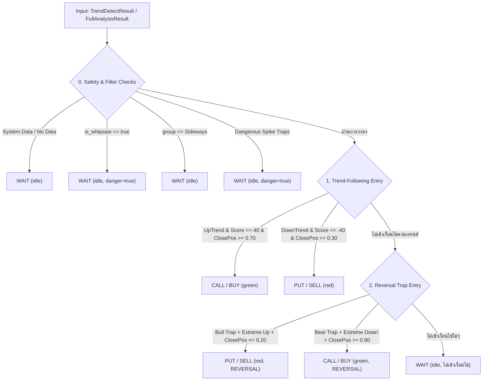

# สรุป Logic การหา Action จาก `getActionByPKTrend.rs`

เอกสารนี้สรุปโครงสร้างตรรกะการประเมินสัญญาณเทรด (Trade Spot Evaluation Engine) จากไฟล์:
`D:\Rust\turbo-indicators\turbo-indicators_v2\indicators_Multiplex_Ver1\src\getActionByPKTrend.rs`
ซึ่งแปลงตรรกะมาจาก `PkTrendEvaluator.js` เพื่อประเมินและตัดสินใจออก Action (`CALL`, `PUT`, `WAIT`) และ `suggest_color` (`green`, `red`, `idle`) ในระดับ Rust Native

---

## 1. ภาพรวมการทำงาน (Overview)

`getActionByPKTrend.rs` ทำหน้าที่เป็น **Rule-based Decision Engine** ที่นำผลการวิเคราะห์เทรนด์ (จาก `pkDetectTrend_v5.rs`) มารวมกับเกณฑ์การตัดสินใจ (Options) เพื่อตอบคำถามว่า:
> **"แท่งเทียนนี้ควรเปิด Action อะไร (CALL / PUT / WAIT), แนะนำสีอะไร (green / red / idle), มีความเสี่ยงหรือระดับความแรงเท่าใด?"**



---

## 2. Input Data (ข้อมูลที่รับเข้ามา)

ระบบรองรับ Input ผ่าน 2 ฟังก์ชันหลัก โดยรับข้อมูลแท่งเทียนร่วมกับพารามิเตอร์การปรับแต่ง (`PkTrendOptions`):

### 2.1 ฟังก์ชันที่เปิดให้เรียกใช้ (Public Functions)

1. **`evaluate_pk_trend_entry(pk_trend: &TrendDetectResult, options: Option<&PkTrendOptions>) -> PkTrendDecision`**
   - รับผลลัพธ์ของ PK Trend V5 โดยตรง 1 แท่ง
2. **`get_action_by_full_analysis(analysis: &FullAnalysisResult, options: Option<&PkTrendOptions>) -> PkTrendDecision`**
   - รับก้อนผลวิเคราะห์ภาพรวม (`FullAnalysisResult`) ซึ่งดึง `analysis.pk_trend` ไปประเมินต่อ
3. **`filter_candles_by_pk_trend(candles: &[FullAnalysisResult], options: Option<&PkTrendOptions>) -> Vec<SpotTradeResult>`**
   - รับ Array ของแท่งเทียนทั้งหมด แล้วคัดกรองเฉพาะแท่งที่มี Action (`CALL` หรือ `PUT`) ตัด `WAIT` ทิ้ง
4. **`filter_pk_trend_slice(pk_trends: &[TrendDetectResult], options: Option<&PkTrendOptions>) -> Vec<(usize, PkTrendDecision)>`**
   - คัดกรอง Slice ของ `TrendDetectResult` พร้อม Index

---

### 2.2 ฟิลด์จาก `TrendDetectResult` ที่ถูกนำมาใช้ตัดสินใจ

| ฟิลด์ | ชนิดข้อมูล | ตัวอย่างค่า | ความหมาย / วัตถุประสงค์ในการใช้ |
| :--- | :--- | :--- | :--- |
| `case_code` | `&'static str` | `"UP-CONFIRM"`, `"SPK-BULLTRAP"`, `"RJ-BULLTRAP-STRONG"` | รหัสเคสรูปแบบแท่งเทียน |
| `group` | `&'static str` | `"Up"`, `"Down"`, `"Engulfing"`, `"Spike"`, `"Rejected"`, `"Sideways"`, `"System"` | กลุ่มลักษณะของแท่งเทียน |
| `trend` | `Option<&'static str>` | `Some("UpTrend")`, `Some("DownTrend")`, `Some("Sideways")` | ทิศทางเทรนด์หลัก |
| `trend_score` | `i32` | `-100` ถึง `+100` (เช่น `65`, `-55`) | คะแนนกำลังของเทรนด์ |
| `close_position` | `Option<f64>` | `0.0` ถึง `1.0` (Default: `0.5`) | ตำแหน่งราคาปิดเมื่อเทียบกับ Range ของแท่ง (0.0=ต่ำสุด, 1.0=สูงสุด) |
| `extreme_trend` | `Option<&'static str>` | `Some("UpTrend")`, `Some("DownTrend")` | ทิศทางเทรนด์สุดโต่ง (ใช้ยืนยัน Reversal) |
| `is_whipsaw` | `bool` | `true` / `false` | ธงแจ้งว่าอยู่ในช่วงตลาดสับขาหลอก/ฟันปลาหรือไม่ |
| `whipsaw_status` | `WhipsawStatus` | `ConfirmedWhipsaw`, `EnteringWhipsaw` | สถานะ Whipsaw เพื่อนำมาใส่ใน Reason |
| `trend_strength` | `TrendStrength` | `UltraStrongUp`, `StrongUp`, `StrongDown` ฯลฯ | ระดับความแรงของเทรนด์ |

---

### 2.3 โครงสร้าง Option ปรับแต่ง (`PkTrendOptions`)

หากส่ง `None` เข้ามา ระบบจะใช้ค่า Default ดังนี้:

```rust
pub struct PkTrendOptions {
    pub min_trend_score_strong: i32,     // ค่าเริ่มต้น: 40 (คะแนนเทรนด์ขั้นต่ำ)
    pub min_close_conviction_up: f64,    // ค่าเริ่มต้น: 0.70 (ราคาปิดต้องอยู่ >= 70% ของแท่งสำหรับ CALL)
    pub max_close_conviction_down: f64,  // ค่าเริ่มต้น: 0.30 (ราคาปิดต้องอยู่ <= 30% ของแท่งสำหรับ PUT)
    pub allow_trap_reversal: bool,       // ค่าเริ่มต้น: true (เปิดรับสัญญาณสวนเทรนด์จาก Trap)
    pub allow_spike_continuation: bool, // ค่าเริ่มต้น: true (เปิดรับสัญญาณตามแรงแท่ง Spike)
}
```

---

## 3. Output Data (สิ่งที่ Return กลับไป)

### 3.1 ผลลัพธ์ระดับแท่งเดียว: `PkTrendDecision`

```rust
pub struct PkTrendDecision {
    pub signal: TradeSpotSignal,      // Buy | Sell | Wait (JSON: "BUY", "SELL", "WAIT")
    pub trade_type: TradeType,        // Call | Put | Wait (JSON: "CALL", "PUT", "WAIT")
    pub suggest_color: String,        // "green" | "red" | "idle"
    pub reason: String,               // คำอธิบายเหตุผลและค่าประกอบ (เช่น CaseCode, Score, ClosePos)
    pub strength: Option<String>,     // ระดับความแรง เช่น "STRONG_UP", "REVERSAL" (หรือ None)
    pub danger: Option<bool>,         // Some(true) เมื่อเป็นแท่งอันตราย/หลอก
    pub case_code: String,            // รหัส Case Code ของแท่งนั้น
}
```

### 3.2 ผลลัพธ์ระดับคัดกรอง Dataset: `SpotTradeResult`

สำหรับฟังก์ชัน `filter_candles_by_pk_trend` จะ Return เฉพาะแท่งที่ไม่ใช่ `WAIT` พร้อมแนบข้อมูลแท่งเทียน:
- `index: usize`
- `candletime: i64`
- `candletime_display: String`
- `close: f64`
- ฟิลด์ทั้งหมดของ `PkTrendDecision` (`signal`, `trade_type`, `suggest_color`, `reason`, `strength`, `danger`, `case_code`)

---

## 4. รายละเอียด Logic การตัดสินใจ (Step-by-Step)

การตัดสินใจในฟังก์ชัน `evaluate_pk_trend_entry` มีลำดับ 4 ขั้นตอนสำคัญ:

### ขั้นที่ 0: ตัวกรองความปลอดภัย (Safety & Exclusion Filters)
*หากเข้าเงื่อนไขในขั้นตอนนี้ จะตัดเป็น **`WAIT`** ทันที เพื่อป้องกันการขาดทุน*

1. **0.0 ข้อมูลไม่สมบูรณ์ / ระบบ:**
   - เช็ค: `group == "System"` หรือ `trend.is_none()` หรือ `case_code == "SYS-NODATA"`
   - ผล: `signal = Wait`, `trade_type = Wait`, `suggest_color = "idle"`, `reason = "ข้อมูลไม่พอ (SYS-NODATA)"`
2. **0.1 ตลาดฟันปลา (Whipsaw Filter):**
   - เช็ค: `pk_trend.is_whipsaw == true`
   - ผล: `signal = Wait`, `trade_type = Wait`, `suggest_color = "idle"`, `danger = Some(true)`, `reason = "<whipsaw_status> — เสี่ยงโดนหลอกฟันปลาสูง (<case_code>)"`
   - *หมายเหตุ: กรองทิ้งเสมอแม้ Trend Score จะสูงมากก็ตาม*
3. **0.2 ตลาดไม่มีทิศทาง (Sideways Filter):**
   - เช็ค: `group == "Sideways"`
   - ผล: `signal = Wait`, `trade_type = Wait`, `suggest_color = "idle"`, `reason = "Sideways: <case_code>"`
4. **0.3 Spike Trap อันตราย (Stop Hunt / Liquidity Grab):**
   - เช็ค: `case_code` เป็นหนึ่งใน:
     - `"SPK-BULLTRAP"`
     - `"SPK-BEARTRAP"`
     - `"SPK-NODIRECTION"`
     - `"SPK-HESITANT-UP"`
   - ผล: `signal = Wait`, `trade_type = Wait`, `suggest_color = "idle"`, `danger = Some(true)`, `reason = "<case_code> — ความเสี่ยงกลับตัวสูง ไม่ควรเข้า"`

---

### ขั้นที่ 1: เข้าเทรดตามแนวโน้มหลัก (Trend-Following Entry)

เข้าเงื่อนไขเมื่อ:
1. อยู่ในกลุ่ม: `group` เป็น `"Up"`, `"Down"`, `"Engulfing"` หรือ (`"Spike"` เมื่อ `allow_spike_continuation == true`)
2. เทรนด์ต้องไม่ใช่ `"Sideways"` และไม่ใช่ `"Rejected"`

#### ฝั่ง BUY / CALL (แท่งเขียว 🟢)
- **เงื่อนไข:**
  - `trend == "UpTrend"`
  - `trend_score >= opt.min_trend_score_strong` (ค่า default `>= 40`)
  - `close_position >= opt.min_close_conviction_up` (ค่า default `>= 0.70`)
- **Action ที่ได้:**
  - `signal`: `TradeSpotSignal::Buy`
  - `trade_type`: `TradeType::Call`
  - `suggest_color`: `"green"`
  - `strength`: `Some(pk_trend.trend_strength)` (เช่น `"STRONG_UP"`, `"ULTRA_STRONG_UP"`)
  - `reason`: `"<case_code> (<trend_strength>) score=<trend_score> closePos=<close_pos>"`

#### ฝั่ง SELL / PUT (แท่งแดง 🔴)
- **เงื่อนไข:**
  - `trend == "DownTrend"`
  - `trend_score <= -opt.min_trend_score_strong` (ค่า default `<= -40`)
  - `close_position <= opt.max_close_conviction_down` (ค่า default `<= 0.30`)
- **Action ที่ได้:**
  - `signal`: `TradeSpotSignal::Sell`
  - `trade_type`: `TradeType::Put`
  - `suggest_color`: `"red"`
  - `strength`: `Some(pk_trend.trend_strength)` (เช่น `"STRONG_DOWN"`, `"ULTRA_STRONG_DOWN"`)
  - `reason`: `"<case_code> (<trend_strength>) score=<trend_score> closePos=<close_pos>"`

---

### ขั้นที่ 2: เข้าเทรดสวนแนวโน้มจากกับดักราคา (Reversal Entry)

ใช้จับจังหวะกับดักราคา (Bull Trap / Bear Trap) ที่คอนเฟิร์มแล้ว เมื่อ `opt.allow_trap_reversal == true` และ `group == "Rejected"`:

#### 1. Bull Trap ยืนยัน -> SELL / PUT (แท่งแดง 🔴 สวนเทรนด์)
- **เงื่อนไข:**
  - `case_code == "RJ-BULLTRAP-STRONG"`
  - `extreme_trend == "UpTrend"`
  - `close_position <= 0.20` (ราคาปิดถูกทุบลงมาปิดที่ 20% ล่างสุดของแท่ง)
- **Action ที่ได้:**
  - `signal`: `TradeSpotSignal::Sell`
  - `trade_type`: `TradeType::Put`
  - `suggest_color`: `"red"`
  - `strength`: `Some("REVERSAL")`
  - `reason`: `"Bull Trap ยืนยัน closePos=<close_pos>"`

#### 2. Bear Trap ยืนยัน -> BUY / CALL (แท่งเขียว 🟢 สวนเทรนด์)
- **เงื่อนไข:**
  - `case_code == "RJ-BEARTRAP-STRONG"`
  - `extreme_trend == "DownTrend"`
  - `close_position >= 0.80` (ราคาปิดถูกดันกลับขึ้นมาปิดที่ 80% บนสุดของแท่ง)
- **Action ที่ได้:**
  - `signal`: `TradeSpotSignal::Buy`
  - `trade_type`: `TradeType::Call`
  - `suggest_color`: `"green"`
  - `strength`: `Some("REVERSAL")`
  - `reason`: `"Bear Trap ยืนยัน closePos=<close_pos>"`

---

### ขั้นที่ 3: กรณีไม่เข้าเงื่อนไขใด ๆ (Fallback)
- หากไม่ตรงกับข้อ 1 หรือ 2:
  - `signal`: `TradeSpotSignal::Wait`
  - `trade_type`: `TradeType::Wait`
  - `suggest_color`: `"idle"`
  - `strength`: `None`
  - `danger`: `None`
  - `reason`: `"<case_code> ไม่เข้าเงื่อนไขที่ตั้งไว้ (score=<trend_score>)"`

---

## 5. ตารางสรุป Mapping ผลลัพธ์

| สถานการณ์ | `signal` | `trade_type` | `suggest_color` | `strength` | `danger` |
| :--- | :---: | :---: | :---: | :---: | :---: |
| ข้อมูลไม่พอ / SYS-NODATA | `WAIT` | `WAIT` | `"idle"` | `None` | `None` |
| ตลาดฟันปลา (Whipsaw) | `WAIT` | `WAIT` | `"idle"` | `None` | `Some(true)` |
| ตลาด Sideways | `WAIT` | `WAIT` | `"idle"` | `None` | `None` |
| Spike Trap ปลายคลื่น | `WAIT` | `WAIT` | `"idle"` | `None` | `Some(true)` |
| UpTrend แข็งแกร่ง + ปิดบน | `BUY` | `CALL` | `"green"` | `"STRONG_UP"` / `"ULTRA_STRONG_UP"` | `None` |
| DownTrend แข็งแกร่ง + ปิดล่าง | `SELL` | `PUT` | `"red"` | `"STRONG_DOWN"` / `"ULTRA_STRONG_DOWN"` | `None` |
| ยืนยัน Bull Trap | `SELL` | `PUT` | `"red"` | `"REVERSAL"` | `None` |
| ยืนยัน Bear Trap | `BUY` | `CALL` | `"green"` | `"REVERSAL"` | `None` |
| คะแนนไม่ถึง / ปิดกลางแท่ง | `WAIT` | `WAIT` | `"idle"` | `None` | `None` |

---

## 6. ตัวอย่างการนำไปใช้งานในระบบ (Integration Context)

ในไฟล์ `get_action.rs` มีการนำ `getActionByPKTrend.rs` ไปใช้งาน 2 กรณีหลัก:

1. **โหมดกลยุทธ์ `StrategyMode::PKTrend`**:
   - ใช้ผลการตัดสินใจจากโมดูลนี้เป็นสัญญาณหลักในการออกคำสั่งเทรด
2. **ระบบกู้คืนเมื่อแพ้ติดกัน (Loss Recovery: `loss_con >= 3`)**:
   - เมื่อกลยุทธ์ปกติเกิดการแพ้ต่อเนื่องตั้งแต่ 3 ครั้งขึ้นไป ระบบจะเรียก `get_action_by_full_analysis(analysis, None)` เพื่อขอ `suggest_color` และเหตุผลจาก PKTrend มาช่วยกรองความแม่นยำแทน
