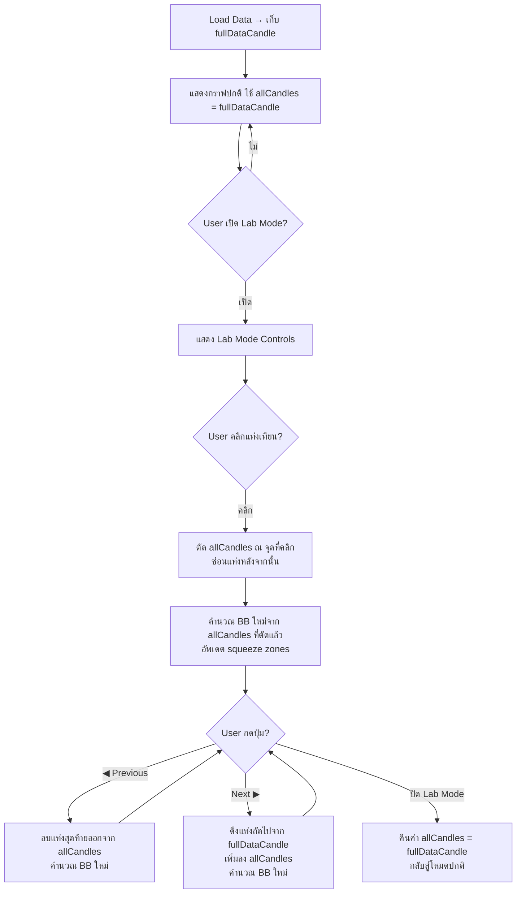

# 📊 Plan: Bollinger Band Real-Time Lab Mode

## 1. สรุปปัญหา (Problem Statement)

### 1.1 ปัญหาหลัก: Squeeze Zone Detection ใน Real-Time

เมื่อต้องการใช้ Bollinger Band Squeeze Zone ในการเทรดจริง (real-time) มีปัญหาสำคัญดังนี้:

#### ❌ ปัญหาเดิม (Non-Causal / Look-Ahead Bias)
```
Algorithm เดิม:
  threshold = percentile(bandwidth ของทุกแท่งเทียนบนกราฟ)
```

| ปัญหา | รายละเอียด |
|-------|-----------|
| **Look-Ahead Bias** | ใช้ข้อมูลอนาคตในการคำนวณ threshold — ในชาร์ตย้อนหลังดูสวย แต่ใช้จริงไม่ได้ |
| **Threshold ไม่เสถียร** | เมื่อแท่งเทียนใหม่เข้ามา threshold เปลี่ยน → squeeze zone เก่าอาจหายหรือเกิดใหม่ย้อนหลัง |
| **ไม่สามารถตัดสินใจ ณ จุดนั้นได้** | ณ แท่งเทียนปัจจุบัน ไม่รู้ว่าจะเป็น squeeze หรือไม่ เพราะ threshold ยังไม่นิ่ง |

#### ✅ แก้ไขแล้ว (Rolling Window Percentile — Causal)
```
Algorithm ใหม่:
  ที่แท่ง N: threshold = percentile(bandwidth ของแท่ง N-lookback ถึง N-1)
  → ดูแค่ข้อมูลย้อนหลัง ไม่มองอนาคต
  → lag = 0 แท่ง (detect ทันทีที่ bandwidth ปัจจุบัน < rolling threshold)
```

### 1.2 ปัญหาที่ยังเหลือ: ไม่สามารถทดสอบ Real-Time ได้จากชาร์ต

แม้ algorithm จะเป็น causal แล้ว แต่ยังไม่มีวิธี **จำลองสถานการณ์ real-time** บนชาร์ตย้อนหลัง:

- ผู้ใช้เห็นแท่งเทียนทั้งหมดพร้อมกัน → ไม่เห็นว่า ณ จุดนั้น squeeze zone จะปรากฏอย่างไร
- ไม่สามารถ "เล่นซ้ำ" แบบ step-by-step เพื่อดูว่า BB + Squeeze เปลี่ยนอย่างไรเมื่อแท่งเทียนใหม่เข้ามา
- ไม่มีวิธีตรวจสอบว่า ณ จุดตัดสินใจเทรด มี squeeze signal หรือยัง

---

## 2. Feature Proposal: Lab Mode 🧪

### 2.1 แนวคิด

เพิ่ม **Lab Mode** ที่ให้ผู้ใช้ "เล่นซ้ำ" (replay) แท่งเทียนทีละแท่ง เพื่อจำลองมุมมอง real-time:

```
┌─────────────────────────────────────────────────────────┐
│  fullDataCandle (ข้อมูลทั้งหมดที่โหลดมา)                  │
│  [c1] [c2] [c3] [c4] [c5] [c6] [c7] [c8] [c9] [c10]   │
│                          ▲                               │
│                      cutoff point                        │
│                                                          │
│  allCandles (แสดงบนกราฟ) = [c1] [c2] [c3] [c4] [c5]     │
│  ซ่อนไว้ (ยังไม่แสดง)      = [c6] [c7] [c8] [c9] [c10]  │
└─────────────────────────────────────────────────────────┘
```

### 2.2 Flow การทำงาน



### 2.3 รายละเอียด Implementation

#### Step 1: เก็บข้อมูลต้นฉบับ — `fullDataCandle`

```javascript
// เมื่อ load data สำเร็จ (ทั้งจาก MySQL และ Deriv WS)
var fullDataCandle = []; // ข้อมูลแท่งเทียนต้นฉบับทั้งหมด

// ใน applyCandlesAndMarkers() หลัง allCandles ถูกกำหนดค่า:
if (fullDataCandle.length === 0) {
    fullDataCandle = allCandles.slice(); // Deep copy ครั้งแรก
}
```

#### Step 2: เมื่อคลิกแท่งเทียน (Lab Mode) — ตัดข้อมูล

```javascript
// เมื่อ labMode = true และ user คลิกแท่งเทียน:
function labModeCutAtCandle(clickedTime) {
    // หา index ใน fullDataCandle
    var cutIdx = -1;
    for (var i = 0; i < fullDataCandle.length; i++) {
        if (fullDataCandle[i].time === clickedTime) {
            cutIdx = i;
            break;
        }
    }
    if (cutIdx < 0) return;

    // ตัดแท่งเทียนหลังจากจุดที่คลิกออก
    labCutIndex = cutIdx;  // เก็บ index ที่ตัด
    allCandles = fullDataCandle.slice(0, cutIdx + 1);

    // อัพเดตกราฟ
    candleSeries.setData(allCandles);
    updateMarkers();
    if (showBollinger) updateBollingerBands();
    updateLabModeInfo();
}
```

#### Step 3: ปุ่ม Previous / Next

```javascript
// ปุ่ม Next ▶ — เพิ่มแท่งถัดไป
function labModeNext() {
    if (labCutIndex >= fullDataCandle.length - 1) return; // สุดแล้ว
    labCutIndex++;
    allCandles = fullDataCandle.slice(0, labCutIndex + 1);

    candleSeries.setData(allCandles);
    updateMarkers();
    if (showBollinger) updateBollingerBands();
    updateLabModeInfo();

    // Scroll ให้เห็นแท่งสุดท้าย
    chart.timeScale().scrollToPosition(2, false);
}

// ปุ่ม ◀ Previous — ถอยกลับ 1 แท่ง
function labModePrev() {
    if (labCutIndex <= 0) return;
    labCutIndex--;
    allCandles = fullDataCandle.slice(0, labCutIndex + 1);

    candleSeries.setData(allCandles);
    updateMarkers();
    if (showBollinger) updateBollingerBands();
    updateLabModeInfo();
}
```

### 2.4 UI Controls (Lab Mode Bar)

```
┌──────────────────────────────────────────────────────────────┐
│  🧪 Lab Mode   [ON/OFF]                                     │
│                                                              │
│  ◀ Prev  │  ▶ Next  │  ⏭ +5  │  ⏮ -5  │  🔄 Reset         │
│                                                              │
│  📊 แท่งที่: 145 / 320   │  BB Squeeze: ●Active              │
│  📅 เวลาปัจจุบัน: 14:25   │  Bandwidth: 0.0023               │
└──────────────────────────────────────────────────────────────┘
```

| ปุ่ม/Control | การทำงาน |
|-------------|---------|
| `🧪 Lab Mode ON/OFF` | เปิด/ปิด Lab Mode (ปิดแล้วคืนค่าทุกอย่าง) |
| `◀ Prev` | ถอยกลับ 1 แท่ง |
| `▶ Next` | เพิ่มแท่งถัดไป 1 แท่ง |
| `⏭ +5` | เพิ่มทีละ 5 แท่ง (fast forward) |
| `⏮ -5` | ถอยกลับ 5 แท่ง (rewind) |
| `🔄 Reset` | คืนค่ากลับไปจุดที่คลิกตัดครั้งแรก |
| `📊 Info` | แสดง index ปัจจุบัน / ทั้งหมด, สถานะ squeeze, bandwidth |

### 2.5 State Variables ที่ต้องเพิ่ม

```javascript
var labMode = false;          // เปิด/ปิด Lab Mode
var fullDataCandle = [];      // ข้อมูลแท่งเทียนต้นฉบับทั้งหมด
var labCutIndex = -1;         // index ปัจจุบันที่ตัด (ใน fullDataCandle)
var labOriginalCutIndex = -1; // index แรกที่ user คลิกตัด (สำหรับ Reset)
```

### 2.6 สิ่งที่ต้องระวัง

| หัวข้อ | รายละเอียด |
|-------|-----------|
| **Trade Markers** | ต้อง filter markers ให้แสดงเฉพาะที่อยู่ใน allCandles (ก่อน cutoff) |
| **Tooltip** | ควรแสดง info ว่าอยู่ใน Lab Mode และ position ที่เท่าไหร่ |
| **BB Recalculation** | ทุกครั้งที่เพิ่ม/ลบแท่ง ต้อง recalculate BB + squeeze ใหม่ทั้งหมด |
| **Squeeze Lookback** | ถ้า allCandles น้อยกว่า lookback window → squeeze อาจทำงานไม่สมบูรณ์ ต้องแสดง warning |
| **Performance** | การ recalculate BB ทุก step ไม่น่ามีปัญหาเพราะข้อมูลส่วนใหญ่ < 500 bars |
| **Keyboard Shortcuts** | ควรเพิ่ม Arrow Left/Right เป็น shortcut สำหรับ Prev/Next |

---

## 3. ลำดับการพัฒนา (Implementation Order)

- [x] **3.1** สร้าง `fullDataCandle` — เก็บข้อมูลต้นฉบับเมื่อ load เสร็จ
- [x] **3.2** เพิ่ม Lab Mode toggle switch ใน controls bar
- [x] **3.3** สร้าง Lab Mode controls bar (Prev/Next/+5/-5/Reset/Info)
- [x] **3.4** Implement `labModeCutAtCandle()` — ตัดแท่งเทียนเมื่อคลิก
- [x] **3.5** Implement `labModeNext()` / `labModePrev()` — เพิ่ม/ลดแท่งเทียน
- [x] **3.6** Auto recalculate BB + Squeeze ทุกครั้งที่ candle set เปลี่ยน
- [x] **3.7** Filter trade markers ตาม cutoff
- [x] **3.8** แสดง info bar (index, squeeze status, bandwidth)
- [x] **3.9** เพิ่ม Keyboard shortcuts (←/→ = prev/next, Shift+←/→ = -5/+5)
- [x] **3.10** Reset + ปิด Lab Mode → คืนค่า allCandles = fullDataCandle

---

## 4. ประโยชน์ที่ได้

| ประโยชน์ | รายละเอียด |
|---------|-----------|
| 🎯 **ทดสอบ Strategy** | เล่นซ้ำ step-by-step ดูว่า ณ จุดตัดสินใจ squeeze signal เกิดแล้วหรือยัง |
| 📐 **ตรวจสอบ BB Lag** | เห็นชัดว่า BB เส้น upper/lower ปรับตัวเร็วแค่ไหนเมื่อใช้ SMA vs EMA vs HMA |
| 🟣 **Validate Squeeze** | ยืนยันว่า rolling window percentile ให้ signal ที่ถูกต้อง ณ แต่ละจุด |
| 🧠 **Training** | ฝึกสังเกตพฤติกรรม BB squeeze → expansion ก่อนนำไปใช้เทรดจริง |
